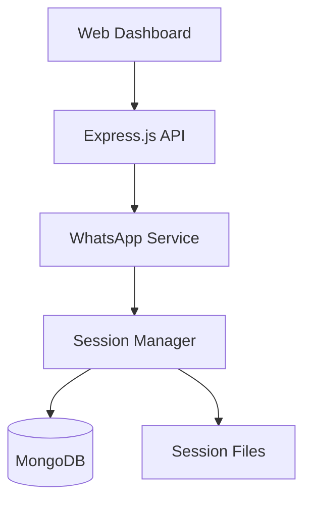

# WhatsApp API - Onboarding Presentation Outline

**Presentation Title**: WhatsApp API Integration Platform - Quick Start Guide  
**Duration**: 30 minutes  
**Audience**: Technical teams, stakeholders, and new developers  
**Format**: Interactive demonstration with live coding

---

## 🎯 Presentation Structure

### **Slide 1-3: Introduction & Overview** (5 minutes)

#### Slide 1: Welcome & Objectives
- **Project Overview**: Enterprise WhatsApp API Integration
- **What You'll Learn**: Setup, authentication, messaging, deployment
- **Expected Outcome**: Ready to integrate and deploy
- **Prerequisites**: Node.js, MongoDB, basic REST API knowledge

#### Slide 2: Business Value Proposition
- **Cost Savings**: 70% reduction vs. third-party APIs
- **Scalability**: 50+ concurrent WhatsApp sessions
- **Features**: Text, images, documents, locations, group messaging
- **Integration Time**: 15 minutes to first message sent

#### Slide 3: Technical Excellence
- **Architecture**: Microservices-ready with clean separation
- **Performance**: <2s QR generation, 98% authentication success
- **Security**: JWT authentication, rate limiting, input validation
- **Monitoring**: Comprehensive health checks and logging

---

### **Slide 4-8: System Architecture** (8 minutes)

#### Slide 4: High-Level Architecture Diagram


#### Slide 5: Core Components
- **Express.js Server**: REST API and static file serving
- **Socket.IO**: Real-time WebSocket communication
- **WhatsApp Service**: Baileys integration and message handling
- **Session Manager**: Lifecycle management and cleanup
- **MongoDB**: Persistent data storage
- **File System**: WhatsApp session credentials

#### Slide 6: Data Flow - Authentication
- QR code generation → WebSocket emission → Mobile scan → Authentication success
- Auto-reconnection with stored credentials
- Session state management and cleanup

#### Slide 7: Data Flow - Messaging
- API request → Session validation → Baileys integration → WhatsApp servers
- Message delivery confirmation and status tracking
- Database logging and audit trail

#### Slide 8: Security & Performance
- **Security**: JWT tokens, rate limiting, input validation, session isolation
- **Performance**: Connection pooling, caching, memory optimization
- **Scalability**: Horizontal scaling, load balancing, multi-instance support

---

### **Slide 9-15: Live Demo & Hands-On** (12 minutes)

#### Slide 9: Environment Setup (Demo)
```bash
# Clone and setup
git clone <repository-url>
cd whatsapp-api
npm install
cp .env.example .env
# Edit .env with MongoDB URI and JWT secret
```

#### Slide 10: First Run (Demo)
```bash
# Start development server
npm run dev

# Verify health check
curl http://localhost:3000/api/health
```

#### Slide 11: Authentication Flow (Live Demo)
1. **Frontend Integration**: Connect WebSocket client
2. **QR Generation**: POST request to `/api/auth/QRlogin`
3. **Mobile Scanning**: Scan QR with WhatsApp mobile app
4. **Success Notification**: WebSocket `auth-success` event
5. **Dashboard Redirect**: Automatic navigation to dashboard

#### Slide 12: Sending Messages (Live Demo)
```bash
# Send text message
curl -X POST http://localhost:3000/api/messaging/send-text \
  -H "Content-Type: application/json" \
  -d '{
    "sessionId": "demo_session",
    "to": "1234567890@s.whatsapp.net",
    "text": "Hello from WhatsApp API!"
  }'
```

#### Slide 13: WebSocket Integration (Code Example)
```javascript
// Frontend WebSocket integration
const socket = io('http://localhost:3000');

socket.emit('join-session', 'demo_session');

socket.on('qr-code', (data) => {
  document.getElementById('qr-image').src = data.qrCode;
});

socket.on('auth-success', (data) => {
  window.location.href = '/dashboard';
});
```

#### Slide 14: Advanced Features (Demo)
- **Image Upload**: Multipart form data for image messages
- **Document Sharing**: File upload and document messaging
- **Location Sharing**: GPS coordinates and address mapping
- **Session Management**: Status checking and cleanup

#### Slide 15: Monitoring & Health Checks (Demo)
```bash
# System health
curl http://localhost:3000/api/health

# Session status
curl http://localhost:3000/api/auth/status/demo_session

# Active sessions
curl http://localhost:3000/api/session/active
```

---

### **Slide 16-20: Production Deployment** (5 minutes)

#### Slide 16: Production Architecture
- **Load Balancer**: Nginx reverse proxy with SSL
- **Application**: PM2 cluster with auto-restart
- **Database**: MongoDB replica set with backups
- **Cache**: Redis for session management
- **Monitoring**: Health checks and alerting

#### Slide 17: Deployment Commands
```bash
# Install PM2
npm install -g pm2

# Production deployment
npm run build
pm2 start ecosystem.config.js --env production

# Enable auto-startup
pm2 startup
pm2 save

# Monitoring
pm2 monit
```

#### Slide 18: Environment Configuration
```bash
# Production .env settings
NODE_ENV=production
PORT=3000
MONGO_URI=mongodb://replica-set/whatsapp_api
JWT_SECRET=production-secret-key
REDIS_URL=redis://redis-cluster:6379
```

#### Slide 19: Security Best Practices
- **SSL/TLS**: HTTPS with Let's Encrypt certificates
- **Firewall**: Port restrictions and IP allowlisting
- **JWT Secrets**: Strong, unique production secrets
- **Database Security**: Authentication and connection encryption
- **Rate Limiting**: API protection configuration

#### Slide 20: Monitoring & Maintenance
- **Health Endpoints**: Automated uptime monitoring
- **Log Management**: Centralized logging with retention
- **Database Backups**: Automated daily backups
- **Session Cleanup**: Automated maintenance scripts
- **Performance Metrics**: Response time and throughput tracking

---

## 🎬 Interactive Elements

### **Live Coding Segments**
1. **Environment Setup** (5 minutes) - Real-time installation and configuration
2. **First Authentication** (5 minutes) - QR generation and mobile scanning
3. **Message Integration** (5 minutes) - Send and receive messages
4. **Production Deployment** (3 minutes) - PM2 and monitoring setup

### **Audience Participation**
- **Q&A Sessions**: After each major section
- **Troubleshooting**: Real-time problem solving
- **Use Case Discussion**: Specific business requirements
- **Integration Planning**: Next steps for their projects

### **Hands-On Exercises**
1. **Setup Challenge**: Get environment running in 10 minutes
2. **Integration Test**: Send your first WhatsApp message
3. **Custom Configuration**: Modify settings for specific needs
4. **Monitoring Setup**: Configure health checks and alerts

---

## 📋 Presentation Materials

### **Required Setup**
- **Laptop/Desktop**: With Node.js, MongoDB, and VS Code
- **Mobile Phone**: With WhatsApp installed for QR scanning
- **Network Access**: Internet connection for package downloads
- **Development Environment**: Terminal/command line access

### **Provided Resources**
- **Source Code**: Complete project repository
- **Documentation**: PDF versions of all guides
- **Configuration Files**: Ready-to-use .env templates
- **Debug Tools**: Pre-configured troubleshooting utilities

### **Post-Presentation Deliverables**
- **Recording**: Full session recording for future reference
- **Code Examples**: All demonstration code in downloadable format
- **Support Materials**: Documentation package and contact information
- **Follow-up Schedule**: Next steps and continued support plan

---

## 🎯 Success Metrics

### **Immediate Goals**
- **100% Setup Success**: All attendees get basic environment running
- **Authentication Demo**: Everyone sees successful QR authentication
- **First Message**: All participants send at least one test message
- **Understanding**: Clear comprehension of architecture and capabilities

### **Post-Presentation Objectives**
- **Production Deployment**: Teams deploy to staging within 1 week
- **Integration**: Connect to existing systems within 2 weeks
- **Go-Live**: Production deployment within 1 month
- **Adoption**: Regular usage of API for business communications

### **Long-term Impact**
- **Cost Reduction**: Measurable savings vs. third-party solutions
- **Efficiency Gains**: Reduced development time for future integrations
- **Scalability Achievement**: Support for growing business requirements
- **Team Competency**: Internal expertise in WhatsApp API management

---

## 📞 Support & Follow-up

### **Immediate Support**
- **Live Q&A**: During and after presentation
- **Documentation**: Comprehensive guides and references
- **Debug Tools**: Built-in troubleshooting utilities
- **Community**: Developer resources and examples

### **Ongoing Support Plan**
- **Week 1**: Setup assistance and initial integration support
- **Week 2-4**: Production deployment guidance
- **Month 1-3**: Performance optimization and advanced features
- **Quarterly**: System updates and new feature discussions

This presentation outline provides a comprehensive, hands-on introduction to the WhatsApp API platform, ensuring attendees can immediately begin using and deploying the solution in their environments.

---

**Presenter**: Technical Lead  
**Duration**: 30 minutes + Q&A  
**Format**: Interactive demo with live coding  
**Materials**: Complete source code and documentation package
