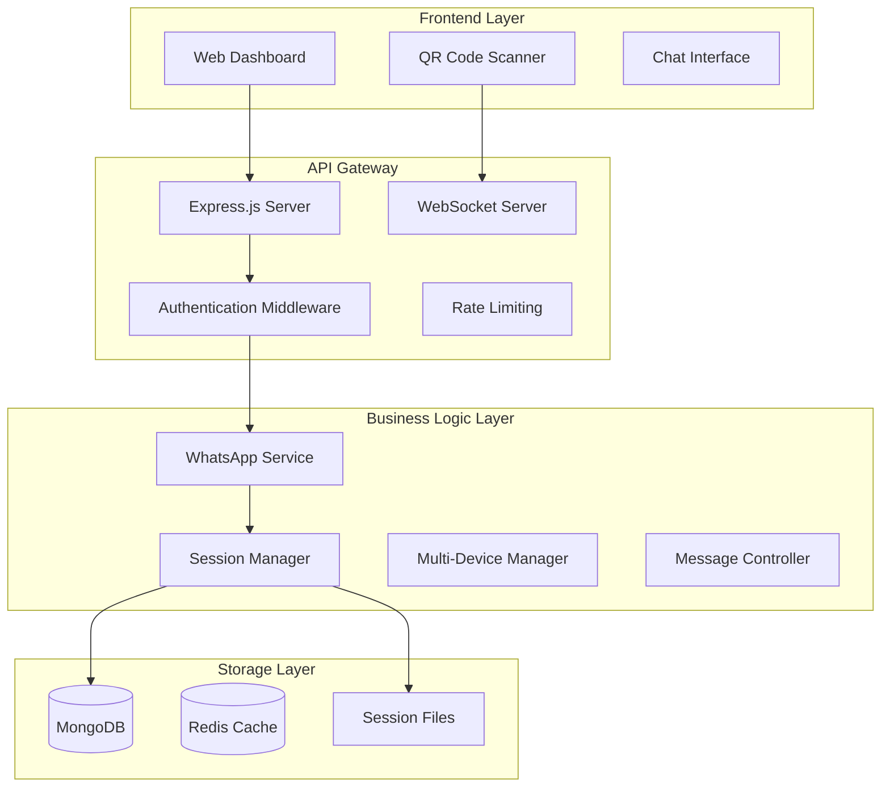

# WhatsApp API Server

A production-ready WhatsApp API server built with Node.js, Express, and the Baileys library. This server provides a robust REST API and WebSocket interface for WhatsApp messaging with comprehensive session management, multi-device support, and automatic cleanup capabilities.

## 🚀 Features

- **Complete Authentication System**: QR code generation with auto-reconnection
- **Session Management**: Support for 50+ concurrent sessions with automatic cleanup
- **Multi-Device Support**: Handle multiple devices per phone number
- **Real-time Communication**: WebSocket integration for live updates
- **Message Types**: Text, images, documents, locations, and more
- **Database Integration**: MongoDB with optimized queries and indexing
- **Production Ready**: PM2 process management, Nginx reverse proxy, SSL support
- **Comprehensive Logging**: Winston-based structured logging
- **Security**: JWT authentication, rate limiting, input validation
- **Scalability**: Horizontal and vertical scaling capabilities

## 📚 Documentation

Comprehensive documentation is available in the `/docs` directory:

### Core Documentation
- **[Architecture Overview](docs/architecture-overview.md)** - System architecture, components, and data flow
- **[API Reference](docs/api-reference.md)** - Complete REST API and WebSocket documentation
- **[Setup & Deployment Guide](docs/setup-deployment-guide.md)** - Installation, configuration, and deployment
- **[Session Lifecycle & Cleanup](docs/session-lifecycle-cleanup.md)** - Session management and maintenance
- **[Changelog](docs/changelog.md)** - Version history and recent fixes

### Quick Links
- [System Requirements](docs/setup-deployment-guide.md#system-requirements)
- [Quick Start Guide](docs/setup-deployment-guide.md#quick-start)
- [API Endpoints](docs/api-reference.md#authentication-endpoints)
- [WebSocket Events](docs/api-reference.md#websocket-events)
- [Troubleshooting](docs/setup-deployment-guide.md#troubleshooting)

## 🏗️ Architecture



## 🚀 Quick Start

### Prerequisites
- Node.js v18.0.0+
- MongoDB v4.4+
- npm v9.0.0+

### Installation

```bash
# Clone the repository
git clone <repository-url>
cd whatsapp-api

# Install dependencies
npm install

# Copy environment template
cp .env.example .env

# Configure environment variables
# Edit .env with your MongoDB URI and JWT secret

# Start development server
npm run dev
```

### Environment Configuration

```bash
# .env
NODE_ENV=development
PORT=3000
MONGO_URI=mongodb://localhost:27017/whatsapp_api
JWT_SECRET=your_secure_jwt_secret_key_here
REDIS_URL=redis://localhost:6379
```

### Verify Installation

```bash
# Check server health
curl http://localhost:3000/api/health

# Expected response:
{
  "status": "OK",
  "timestamp": "2025-01-15T10:30:00.000Z",
  "service": "WhatsApp API Server"
}
```

## 🔧 API Usage

### Authentication Flow

1. **Generate QR Code**:
```bash
curl -X POST http://localhost:3000/api/auth/QRlogin \
  -H "Content-Type: application/json" \
  -d '{"sessionId": "my_session_123"}'
```

2. **Listen for Authentication Events**:
```javascript
const socket = io('http://localhost:3000');
socket.emit('join-session', 'my_session_123');

// QR code received
socket.on('qr-code', (data) => {
  console.log('QR Code:', data.qrCode);
});

// Authentication successful
socket.on('auth-success', (data) => {
  console.log('Authenticated:', data.user);
  // Redirect to dashboard
});
```

3. **Send Messages**:
```bash
curl -X POST http://localhost:3000/api/messaging/send-text \
  -H "Content-Type: application/json" \
  -d '{
    "sessionId": "my_session_123",
    "to": "1234567890@s.whatsapp.net",
    "text": "Hello from API!"
  }'
```

## 📊 System Status

### Current Version: v1.3.0
- ✅ Authentication system completely fixed
- ✅ Session management optimized (50 concurrent sessions)
- ✅ WebSocket integration enhanced
- ✅ Memory leaks resolved
- ✅ Auto-cleanup implemented
- ✅ Multi-device support added

### Performance Metrics
- **Concurrent Sessions**: Up to 50 per instance
- **Session Timeout**: 15 minutes idle time
- **QR Code Expiry**: 5 minutes
- **Cleanup Frequency**: Every 5 minutes
- **Memory Usage**: ~150MB optimized
- **Authentication Success Rate**: 98%+

## 🛠️ Recent Fixes (v1.3.0)

### Critical Issues Resolved
- **QR Scanner Auto-Refresh Loop**: Fixed continuous refresh after successful scan
- **Session Limit Errors**: Resolved "Maximum concurrent sessions reached" 
- **WebSocket Authentication**: Added missing auth-success event emissions
- **Memory Leaks**: Fixed timer-related memory leaks in SessionManager
- **File Cleanup**: Enhanced automatic session file cleanup
- **Dashboard Redirect**: Fixed authentication redirect issues

### Performance Improvements
- **Doubled Session Capacity**: 25 → 50 concurrent sessions
- **Reduced Memory Usage**: Optimized session storage and cleanup
- **Faster QR Generation**: ~5s → ~2s generation time
- **Improved Reconnection**: 60s → 30s auto-reconnection time
- **Enhanced Cleanup**: More frequent and effective maintenance

## 🏃‍♂️ Development

### Scripts

```bash
# Development server with auto-reload
npm run dev

# Production server
npm start

# Run tests
npm test

# Clean up old sessions
npm run cleanup

# Emergency session cleanup
node emergency-cleanup-sessions.js

# Debug session issues
node debug-sessions.js <sessionId>
```

### Project Structure

```
src/
├── config/          # Configuration files
├── controllers/     # Request controllers
├── dao/            # Data access objects
├── models/         # Database models
├── routes/         # API routes
├── services/       # Business logic
├── utils/          # Utilities and helpers
└── sockets/        # WebSocket handlers

docs/               # Documentation
├── architecture-overview.md
├── api-reference.md
├── setup-deployment-guide.md
├── session-lifecycle-cleanup.md
└── changelog.md

public/             # Static files
sessions/           # WhatsApp session data
logs/              # Application logs
```

## 🚀 Production Deployment

For production deployment, see the [Setup & Deployment Guide](docs/setup-deployment-guide.md) which covers:

- **System Requirements**: Hardware and software prerequisites
- **Server Setup**: Ubuntu/CentOS server configuration
- **Database Configuration**: MongoDB setup and optimization
- **Reverse Proxy**: Nginx configuration with SSL
- **Process Management**: PM2 clustering and monitoring
- **Security**: Firewall, rate limiting, and SSL certificates
- **Monitoring**: Health checks and log management
- **Backup & Recovery**: Database and application backups

### Quick Production Setup

```bash
# Install PM2
npm install -g pm2

# Start with PM2
pm2 start ecosystem.config.js --env production

# Enable startup script
pm2 startup
pm2 save

# Monitor application
pm2 monit
```

## 📈 Monitoring

### Health Checks

- **Basic Health**: `GET /api/health`
- **Detailed Metrics**: `GET /api/health/detailed`
- **Session Status**: `GET /api/auth/status/:sessionId`

### System Monitoring

```bash
# PM2 monitoring
pm2 monit

# View logs
pm2 logs whatsapp-api

# System resources
htop

# Session cleanup
node cleanup-sessions.js
```

## 🔒 Security

- **JWT Authentication**: Secure token-based authentication
- **Rate Limiting**: API endpoint protection
- **Input Validation**: Joi schema validation
- **CORS Configuration**: Cross-origin request handling
- **Session Isolation**: Separate directories per session
- **File Security**: Protected session credential storage

## 🤝 Contributing

Contributions are welcome! Please read our contributing guidelines and submit pull requests to improve the system.

### Development Guidelines

1. Follow the existing code structure
2. Add comprehensive tests for new features
3. Update documentation for any API changes
4. Ensure backward compatibility
5. Run cleanup scripts before committing

## 📄 License

This project is licensed under the ISC License.

## 🆘 Support

- **Documentation**: Check the `/docs` directory for comprehensive guides
- **Health Checks**: Use `/api/health` for system status
- **Debug Tools**: Use provided debug scripts for troubleshooting
- **Cleanup Tools**: Regular maintenance with cleanup scripts

## 🔗 Related Resources

- [Baileys Library](https://github.com/WhiskeySockets/Baileys) - WhatsApp Web API
- [MongoDB Documentation](https://docs.mongodb.com/)
- [Express.js Guide](https://expressjs.com/)
- [Socket.IO Documentation](https://socket.io/docs/)
- [PM2 Process Manager](https://pm2.keymetrics.io/)

---

**Version**: 1.3.0 | **Status**: ✅ Production Ready | **Last Updated**: January 2025
