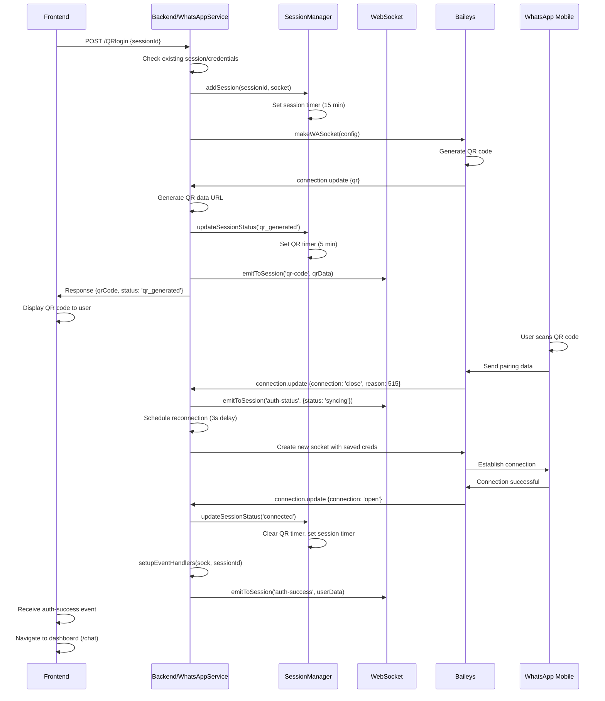
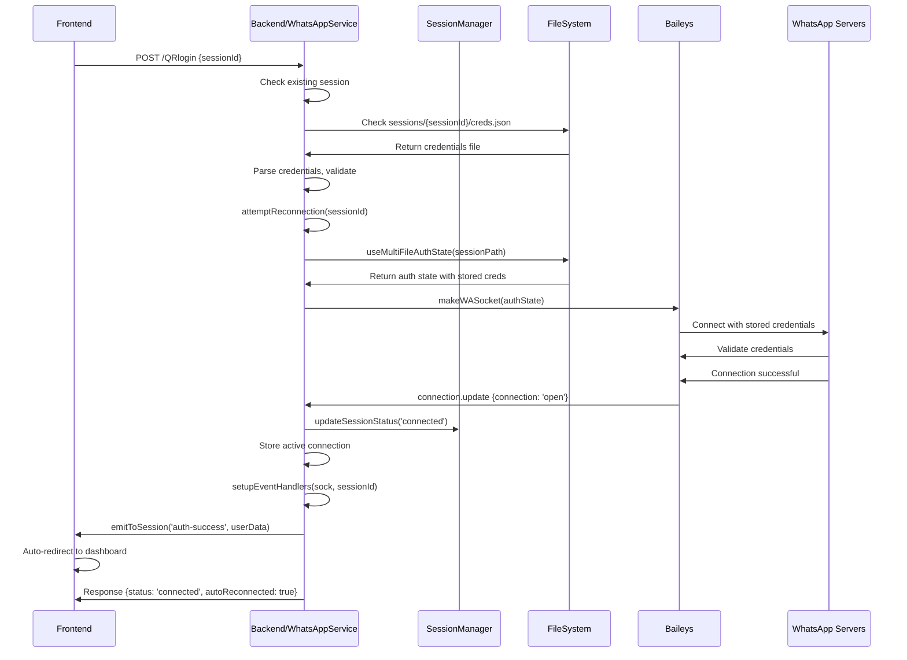
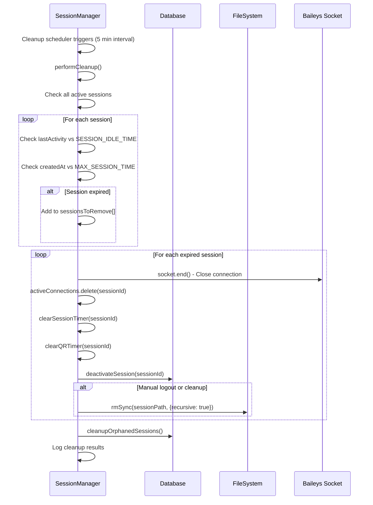

# WhatsApp Service & SessionManager - Deep Dive Documentation

## Table of Contents
- [Overview](#overview)
- [Core Components](#core-components)
- [Session Creation with Baileys](#session-creation-with-baileys)
- [Authentication File Storage](#authentication-file-storage)
- [Session Lifecycle Management](#session-lifecycle-management)
- [Concurrency & Limits](#concurrency--limits)
- [Cleanup Scheduler](#cleanup-scheduler)
- [Sequence Diagrams](#sequence-diagrams)
- [File System Interactions](#file-system-interactions)
- [Multi-Device Support](#multi-device-support)

---

## Overview

The WhatsApp service implements a comprehensive session management system using the Baileys library for WhatsApp Web communication. The system handles:

- **Session Creation**: Using `makeWASocket` from Baileys
- **Authentication Storage**: Multi-file auth state in local file system
- **Lifecycle Management**: QR timers, session timers, and cleanup
- **Concurrency Control**: Limits and load balancing
- **Multi-Device Support**: Multiple devices per phone number

---

## Core Components

### 1. WhatsAppService
- **Location**: `src/services/WhatsAppService.js`
- **Purpose**: Primary interface for creating and managing WhatsApp sessions
- **Key Methods**:
  - `createSession(sessionId)` - Creates new session with QR or auto-reconnect
  - `attemptReconnection(sessionId)` - Auto-reconnects with stored credentials
  - `reconnectSession(sessionId)` - Manual reconnection after pairing
  - `setupEventHandlers(sock, sessionId)` - Configures message/event handlers

### 2. SessionManager
- **Location**: `src/services/SessionManager.js`
- **Purpose**: Manages session lifecycle, timers, and cleanup
- **Key Features**:
  - Active connection tracking
  - QR code expiration timers
  - Session inactivity timers
  - Automatic cleanup scheduler

### 3. MultiDeviceSessionManager
- **Location**: `src/services/MultiDeviceSessionManager.js`
- **Purpose**: Manages multiple device sessions per phone number
- **Features**:
  - Device session mapping
  - Load balancing for message sending
  - Per-device heartbeat monitoring
  - Device limit enforcement

---

## Session Creation with Baileys

### makeWASocket Configuration

```javascript
const sock = makeWASocket({
    auth: state,                          // Multi-file auth state
    printQRInTerminal: false,             // Suppress terminal QR
    logger: baileysLogger,                // Custom filtered logger
    browser: ['WhatsApp Web', 'Chrome', '1.0.0'], // Browser identification
    connectTimeoutMs: 60000,              // Connection timeout
    defaultQueryTimeoutMs: 60000,         // Query timeout
    keepAliveIntervalMs: 10000,           // Keep-alive interval
    emitOwnEvents: true,                  // Emit own message events
    fireInitQueries: true,                // Fire initial queries
    generateHighQualityLinkPreview: true, // High-quality previews
    syncFullHistory: false,               // Don't sync full history
    markOnlineOnConnect: true,            // Mark online on connect
    shouldSyncHistoryMessage: msg => {    // History sync filter
        return !!msg.message && !msg.key.remoteJid?.endsWith('@g.us');
    },
    linkPreviewImageThumbnailWidth: 192,  // Preview thumbnail size
    transactionOpts: {                    // Transaction retry options
        maxCommitRetries: 5,
        delayBetweenTriesMs: 3000
    }
});
```

### Session Creation Flow

1. **Check Existing Session**: Verify if session already connected
2. **Check Stored Credentials**: Look for existing `creds.json` file
3. **Attempt Auto-Reconnection**: If credentials exist, try reconnecting
4. **Create New Session**: If no credentials, create fresh session
5. **Setup Event Handlers**: Configure message and connection handlers
6. **Wait for QR or Connection**: Return QR code or connection status

---

## Authentication File Storage

### File Structure

```
sessions/
├── {sessionId}/
│   ├── creds.json                 # Main credentials file
│   ├── pre-key-{id}.json         # Pre-keys for encryption
│   ├── session-{jid}.json        # Session keys per contact
│   └── app-state-sync-key-{id}.json # App state sync keys
```

### Storage Locations

- **Base Directory**: `process.cwd()/sessions/`
- **Session Path**: `sessions/{sessionId}/`
- **Credentials**: `sessions/{sessionId}/creds.json`

### File Management

```javascript
// Session directory creation
const sessionPath = path.join(process.cwd(), 'sessions', sessionId);
if (!fs.existsSync(sessionPath)) {
    fs.mkdirSync(sessionPath, { recursive: true });
}

// Multi-file auth state
const { state, saveCreds } = await useMultiFileAuthState(sessionPath);

// Credential saving
sock.ev.on('creds.update', async () => {
    await saveCreds();
});
```

### Cleanup Operations

```javascript
// File cleanup on logout
async cleanupSessionFiles(sessionId) {
    const sessionPath = path.join(process.cwd(), 'sessions', sessionId);
    if (fs.existsSync(sessionPath)) {
        fs.rmSync(sessionPath, { recursive: true, force: true });
    }
}
```

---

## Session Lifecycle Management

### Session States

1. **connecting** - Initial connection attempt
2. **qr_generated** - QR code generated and displayed
3. **pairing_success** - QR scanned, establishing connection
4. **syncing** - WhatsApp syncing data after pairing
5. **connected** - Fully connected and operational
6. **reconnecting** - Attempting to reconnect
7. **disconnected** - Connection lost
8. **logged_out** - Permanently logged out
9. **qr_expired** - QR code expired without scan
10. **expired** - Session expired due to inactivity

### Timer Management

#### QR Expiration Timer
```javascript
setQRTimer(sessionId) {
    this.clearQRTimer(sessionId);
    
    const timer = setTimeout(async () => {
        await this.handleQRExpiry(sessionId);
    }, this.config.QR_EXPIRY_TIME); // 5 minutes
    
    this.qrTimers.set(sessionId, timer);
}
```

#### Session Inactivity Timer
```javascript
setSessionTimer(sessionId) {
    this.clearSessionTimer(sessionId);
    
    const timer = setTimeout(async () => {
        await this.removeSession(sessionId, 'expired');
    }, this.config.SESSION_IDLE_TIME); // 15 minutes
    
    this.sessionTimers.set(sessionId, timer);
}
```

### Configuration

#### SessionManager Config
```javascript
config = {
    QR_EXPIRY_TIME: 5 * 60 * 1000,        // 5 minutes
    SESSION_IDLE_TIME: 15 * 60 * 1000,    // 15 minutes
    MAX_SESSION_TIME: 2 * 60 * 60 * 1000, // 2 hours
    CLEANUP_INTERVAL: 5 * 60 * 1000,      // 5 minutes
    MAX_CONCURRENT_SESSIONS: 50           // 50 sessions
}
```

#### MultiDeviceSessionManager Config
```javascript
config = {
    MAX_DEVICES_PER_PHONE: 50,           // 50 devices per phone
    QR_EXPIRY_TIME: 5 * 60 * 1000,       // 5 minutes
    SESSION_IDLE_TIME: 30 * 60 * 1000,   // 30 minutes
    MAX_SESSION_TIME: 24 * 60 * 60 * 1000, // 24 hours
    CLEANUP_INTERVAL: 10 * 60 * 1000,    // 10 minutes
    DEVICE_HEARTBEAT_INTERVAL: 5 * 60 * 1000, // 5 minutes
    MAX_FAILED_HEARTBEATS: 3             // 3 failed heartbeats
}
```

---

## Concurrency & Limits

### Session Limits
- **Max Concurrent Sessions**: 50 per instance (SessionManager)
- **Max Devices per Phone**: 50 (MultiDeviceSessionManager)
- **Connection Timeout**: 60 seconds
- **Query Timeout**: 60 seconds

### Load Balancing
```javascript
getActiveDeviceForSending(phoneNumber) {
    let bestDevice = null;
    let lowestLoad = Infinity;
    
    for (const deviceSession of deviceSessions) {
        const load = deviceSession.messagesSent;
        if (load < lowestLoad) {
            lowestLoad = load;
            bestDevice = deviceSession;
        }
    }
    
    return bestDevice;
}
```

### Concurrency Control
- **Session Creation**: Atomic operations with error handling
- **Connection Management**: Thread-safe Maps for session storage
- **Timer Management**: Proper cleanup to prevent memory leaks

---

## Cleanup Scheduler

### Automatic Cleanup Process

```javascript
async performCleanup() {
    const now = new Date();
    const sessionsToRemove = [];

    // Check for expired sessions
    for (const [sessionId, sessionData] of this.activeConnections.entries()) {
        const timeSinceLastActivity = now - sessionData.lastActivity;
        const timeSinceCreation = now - sessionData.createdAt;

        // Remove if idle too long or exceeded max time
        if (timeSinceLastActivity > this.config.SESSION_IDLE_TIME || 
            timeSinceCreation > this.config.MAX_SESSION_TIME) {
            sessionsToRemove.push(sessionId);
        }
    }

    // Remove expired sessions
    for (const sessionId of sessionsToRemove) {
        await this.removeSession(sessionId, 'cleanup');
    }

    // Clean up orphaned database sessions
    await this.cleanupOrphanedSessions();
}
```

### Cleanup Triggers
- **Scheduled**: Every 5-10 minutes (configurable)
- **Session Removal**: Manual logout, QR expiry, inactivity
- **Application Shutdown**: Graceful cleanup of all sessions

---

## Sequence Diagrams

### 1. QR Generation → Scan → Connect → Dashboard Redirect



### 2. Auto-Reconnection with Stored Credentials



### 3. Session Cleanup Flow



---

## File System Interactions

### Directory Structure Creation
```javascript
// Create session directory hierarchy
const sessionPath = path.join(process.cwd(), 'sessions', sessionId);
if (!fs.existsSync(sessionPath)) {
    fs.mkdirSync(sessionPath, { recursive: true });
}
```

### Credential File Operations
```javascript
// Read existing credentials
const credsPath = path.join(sessionPath, 'creds.json');
if (fs.existsSync(credsPath)) {
    const credsData = JSON.parse(fs.readFileSync(credsPath, 'utf8'));
}

// Save credentials (handled by Baileys)
const { state, saveCreds } = await useMultiFileAuthState(sessionPath);
sock.ev.on('creds.update', async () => {
    await saveCreds(); // Writes to multiple JSON files
});
```

### File Cleanup Operations
```javascript
// Remove session files on logout
async cleanupSessionFiles(sessionId) {
    try {
        const sessionPath = path.join(process.cwd(), 'sessions', sessionId);
        if (fs.existsSync(sessionPath)) {
            fs.rmSync(sessionPath, { recursive: true, force: true });
            logger.info(`Cleaned up session files for ${sessionId}`);
        }
    } catch (error) {
        logger.error(`Error cleaning up session files: ${error}`);
    }
}
```

### File Types Generated

1. **creds.json**: Main authentication credentials
2. **pre-key-{id}.json**: Pre-keys for message encryption
3. **session-{jid}.json**: Session keys for specific contacts
4. **app-state-sync-key-{id}.json**: App state synchronization keys

---

## Multi-Device Support

### Device Session Management
```javascript
// Device session structure
const deviceSessionData = {
    deviceSessionId,
    phoneNumber: cleanPhoneNumber,
    socket,
    deviceInfo: {
        deviceName: 'Device_1',
        userAgent: 'Chrome',
        ipAddress: '192.168.1.100',
        platform: 'Web'
    },
    createdAt: new Date(),
    lastActivity: new Date(),
    lastHeartbeat: new Date(),
    status: 'connecting',
    isActive: true,
    failedHeartbeats: 0,
    messagesSent: 0,
    messagesReceived: 0
};
```

### Device Limits and Management
- **Maximum Devices per Phone**: 50
- **Device Heartbeat Monitoring**: Every 5 minutes
- **Failed Heartbeat Threshold**: 3 attempts
- **Load Balancing**: Based on message count

### Broadcast Messaging
```javascript
async broadcastToAllDevices(phoneNumber, eventType, data) {
    const deviceSessionIds = this.phoneNumberSessions.get(phoneNumber);
    
    for (const deviceSessionId of deviceSessionIds) {
        const deviceSession = this.deviceSessions.get(deviceSessionId);
        
        if (deviceSession?.isActive && deviceSession?.socket) {
            deviceSession.socket.emit(eventType, data);
        }
    }
}
```

---

## Error Handling & Recovery

### Connection Error Handling
- **Error 515**: QR scan successful, requires reconnection
- **Connection Timeout**: 60-second timeout with retry
- **Credential Validation**: Automatic fallback to QR generation
- **Network Issues**: Automatic reconnection attempts

### Recovery Mechanisms
1. **Auto-Reconnection**: Using stored credentials
2. **QR Refresh**: Manual and automatic QR regeneration
3. **Session Recovery**: Persistent session state
4. **Cleanup Recovery**: Remove corrupted sessions

### Monitoring & Logging
- **Baileys Logger**: Filtered to reduce noise
- **Session Activity**: Comprehensive logging of state changes
- **Error Tracking**: Detailed error logging with context
- **Performance Metrics**: Session statistics and timing

---

## WebSocket Integration

### Real-time Communication
```javascript
// WebSocket events emitted
emitToSession(sessionId, 'qr-code', { qrCode, status });
emitToSession(sessionId, 'auth-status', { status, message });
emitToSession(sessionId, 'auth-success', { user, status });
```

### Event Types
- **qr-code**: QR code data for frontend display
- **auth-status**: Connection status updates
- **auth-success**: Successful authentication with user data
- **qr-refresh**: QR code refresh notifications

---

## Best Practices

### Session Management
1. **Always validate session state** before operations
2. **Implement proper cleanup** for all resources
3. **Use appropriate timeouts** for different operations
4. **Monitor session health** with heartbeats
5. **Implement graceful shutdown** procedures

### File System
1. **Create directories recursively** for session storage
2. **Handle file I/O errors** gracefully
3. **Clean up files** on logout/cleanup
4. **Use atomic operations** for critical file updates

### Error Handling
1. **Implement retry logic** for network operations
2. **Log errors with context** for debugging
3. **Provide meaningful error messages** to frontend
4. **Implement circuit breakers** for failing operations

---

## Performance Considerations

### Memory Management
- **Session Cleanup**: Regular cleanup prevents memory leaks
- **Timer Management**: Proper timer cleanup prevents accumulation
- **Connection Pooling**: Reuse connections where possible

### Scalability
- **Concurrent Session Limits**: Prevent resource exhaustion
- **Load Balancing**: Distribute load across devices
- **Database Optimization**: Efficient session storage and retrieval

### Security
- **Credential Storage**: Secure file system storage
- **Session Isolation**: Isolated session directories
- **Authentication Validation**: Proper credential validation

---

This documentation provides a comprehensive overview of the WhatsApp session management system, including detailed sequence diagrams showing the complete flow from QR generation to dashboard redirect, and auto-reconnection scenarios with stored credentials.
