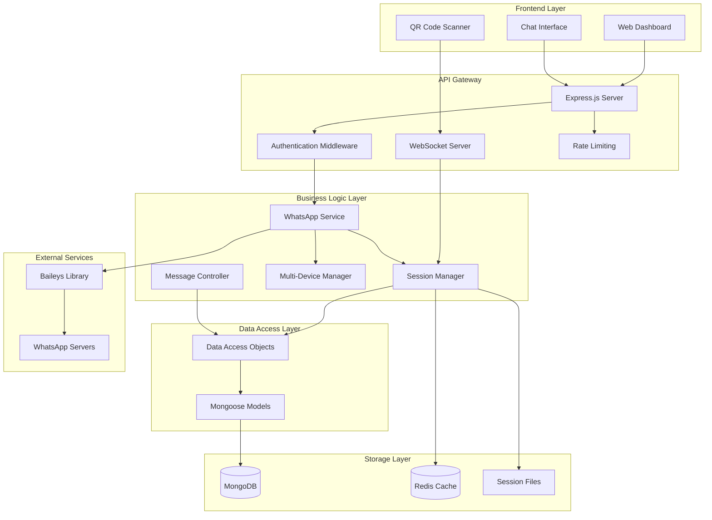
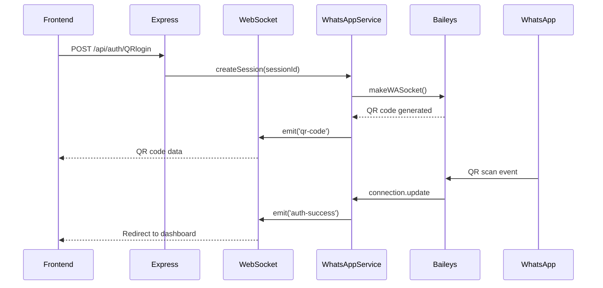
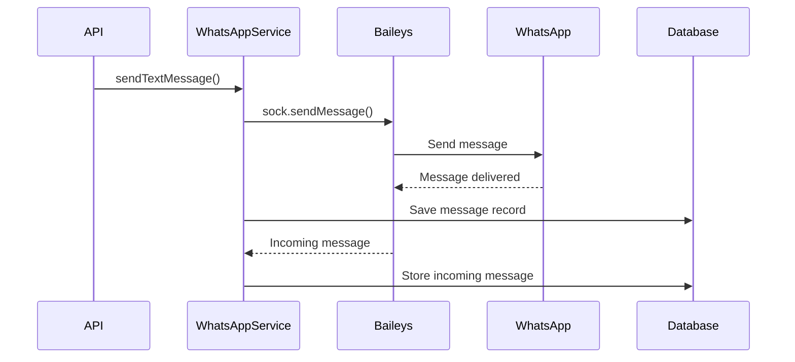
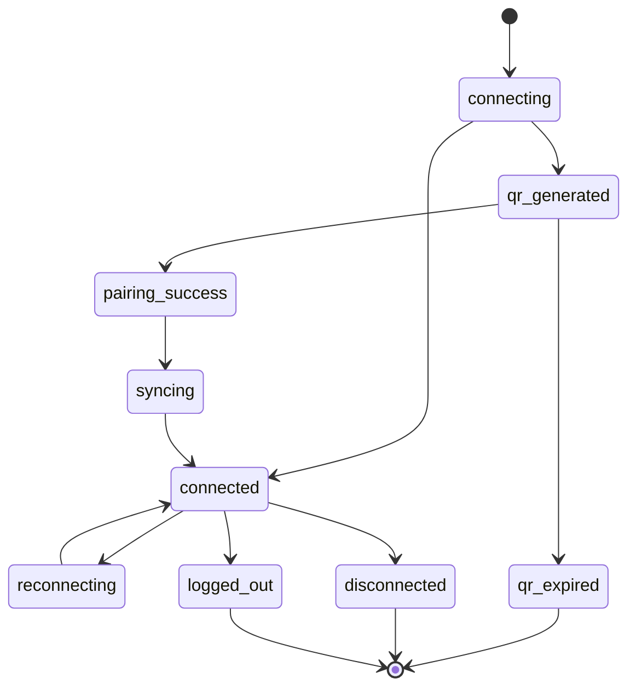

# WhatsApp API - Architecture Overview

## Table of Contents
- [System Architecture](#system-architecture)
- [Core Components](#core-components)
- [Data Flow](#data-flow)
- [Technology Stack](#technology-stack)
- [Service Layer Architecture](#service-layer-architecture)
- [Session Management Architecture](#session-management-architecture)
- [Multi-Device Architecture](#multi-device-architecture)
- [Security Architecture](#security-architecture)
- [Scalability Considerations](#scalability-considerations)
- [Performance Optimizations](#performance-optimizations)

## System Architecture



## Core Components

### 1. Express.js Server (`app.js`)
**Purpose**: Main application entry point and HTTP server
- **Port**: 3000 (configurable via environment)
- **Features**:
  - RESTful API endpoints
  - CORS support
  - Static file serving
  - Error handling middleware
  - Health check endpoints

### 2. WebSocket Server (Socket.IO)
**Purpose**: Real-time communication for QR codes and authentication events
- **Features**:
  - Session joining/monitoring
  - QR code broadcasting
  - Authentication status updates
  - Auto-reconnection support

### 3. WhatsApp Service (`src/services/WhatsAppService.js`)
**Purpose**: Core WhatsApp integration using Baileys library
- **Key Methods**:
  - `createSession()` - Initialize WhatsApp connection
  - `attemptReconnection()` - Auto-reconnect with stored credentials
  - `setupEventHandlers()` - Configure message/event listeners
  - Message sending methods (text, media, documents, location)

### 4. Session Manager (`src/services/SessionManager.js`)
**Purpose**: Lifecycle management and cleanup of WhatsApp sessions
- **Features**:
  - Session limits (50 concurrent sessions)
  - Timer management (QR expiry, session timeout)
  - Automatic cleanup (every 5 minutes)
  - Resource optimization

### 5. Multi-Device Session Manager (`src/services/MultiDeviceSessionManager.js`)
**Purpose**: Handle multiple devices per phone number
- **Features**:
  - Device limit enforcement (50 devices per phone)
  - Load balancing for message distribution
  - Heartbeat monitoring
  - Device session isolation

## Data Flow

### QR Authentication Flow


### Message Flow


## Technology Stack

### Backend Framework
- **Node.js** (v18+) - Runtime environment
- **Express.js** (v5.1.0) - Web framework
- **Socket.IO** (v4.8.1) - WebSocket implementation

### WhatsApp Integration
- **@whiskeysockets/baileys** (v6.7.18) - WhatsApp Web API
- **qrcode** (v1.5.4) - QR code generation

### Database & Storage
- **MongoDB** (via Mongoose v8.17.0) - Primary database
- **Redis** (ioredis v5.4.1) - Caching and session storage
- **File System** - WhatsApp session credentials storage

### Authentication & Security
- **JWT** (jsonwebtoken v9.0.2) - Token-based authentication
- **express-rate-limit** (v8.0.1) - API rate limiting
- **CORS** (v2.8.5) - Cross-origin resource sharing

### Utilities & Logging
- **Winston** (v3.17.0) - Structured logging
- **Joi** (v17.13.3) - Input validation
- **UUID** (v11.1.0) - Unique identifier generation

## Service Layer Architecture

### WhatsApp Service Layer
```javascript
class WhatsAppService {
  // Core Methods
  async createSession(sessionId)
  async attemptReconnection(sessionId)
  async reconnectSession(sessionId)
  
  // Messaging Methods
  async sendTextMessage(sessionId, to, text)
  async sendImageMessage(sessionId, to, buffer)
  async sendDocumentMessage(sessionId, to, buffer)
  async sendLocationMessage(sessionId, to, lat, lng)
  
  // Session Management
  async getSessionInfo(sessionId)
  async getAllActiveSessions()
  async logoutSession(sessionId)
}
```

### Configuration Architecture
```javascript
// Environment Validation (Joi Schema)
const envSchema = Joi.object({
  NODE_ENV: Joi.string().valid('development', 'production', 'test'),
  PORT: Joi.number().default(3000),
  MONGO_URI: Joi.string().uri().required(),
  JWT_SECRET: Joi.string().required(),
  REDIS_URL: Joi.string().uri().optional()
});

// Export Configuration
export default {
  env: envVars.NODE_ENV,
  port: envVars.PORT,
  mongo: { uri: envVars.MONGO_URI },
  jwt: { secret: envVars.JWT_SECRET },
  redis: { url: envVars.REDIS_URL }
};
```

## Session Management Architecture

### Session Lifecycle States


### Session Timer Management
- **QR Expiry Timer**: 5 minutes
- **Session Idle Timer**: 15 minutes
- **Max Session Time**: 2 hours
- **Cleanup Interval**: 5 minutes

### File System Structure
```
sessions/
├── {sessionId}/
│   ├── creds.json                 # Main credentials
│   ├── pre-key-{id}.json         # Encryption keys
│   ├── session-{jid}.json        # Contact sessions
│   └── app-state-sync-key-*.json # App sync keys
```

## Multi-Device Architecture

### Device Session Management
```javascript
const deviceSessionData = {
  deviceSessionId,
  phoneNumber,
  socket,
  deviceInfo: {
    deviceName: 'Device_1',
    userAgent: 'Chrome',
    ipAddress: '192.168.1.100',
    platform: 'Web'
  },
  status: 'connected',
  messagesSent: 0,
  lastHeartbeat: new Date()
};
```

### Load Balancing Strategy
- **Message Distribution**: Round-robin across active devices
- **Health Monitoring**: 5-minute heartbeat intervals
- **Failure Handling**: 3 failed heartbeats = device removal
- **Session Limits**: 50 devices per phone number

## Security Architecture

### Authentication Flow
1. **Session Creation**: Unique session ID generation
2. **QR Generation**: Secure QR code with timeout
3. **Credential Storage**: Encrypted session files
4. **Token Management**: JWT for API authentication
5. **Session Validation**: Continuous session health checks

### Security Measures
- **Rate Limiting**: API endpoint protection
- **Input Validation**: Joi schema validation
- **CORS Configuration**: Restricted origins
- **Session Isolation**: Separate directories per session
- **Credential Encryption**: Baileys built-in encryption

### Error Handling Strategy
```javascript
// Centralized Error Handling
class AppError extends Error {
  constructor(message, statusCode) {
    super(message);
    this.statusCode = statusCode;
    this.isOperational = true;
  }
}

// Error Categories
- ValidationError: Input validation failures
- BusinessError: Business logic violations  
- ConnectionError: WhatsApp connectivity issues
```

## Scalability Considerations

### Horizontal Scaling
- **Load Balancer**: Distribute requests across instances
- **Session Affinity**: Sticky sessions for WebSocket connections
- **Database Sharding**: Partition data by session/phone number
- **Redis Clustering**: Distributed caching layer

### Vertical Scaling
- **Memory Optimization**: Session cleanup and limits
- **Connection Pooling**: Database connection management
- **Process Limits**: Node.js memory configuration
- **File System**: Efficient session file management

### Performance Optimizations

#### Connection Optimization
- **Keep-Alive**: 10-second intervals
- **Connection Timeout**: 60-second limits
- **Pool Configuration**: Min 5, Max 10 connections
- **Query Timeout**: 60-second database queries

#### Memory Management
- **Session Limits**: 50 concurrent sessions per instance
- **Timer Cleanup**: Proper timer clearance
- **Event Listener Management**: Prevent memory leaks
- **Garbage Collection**: Periodic cleanup scheduling

#### Database Optimization
```javascript
// MongoDB Connection Options
const options = {
  maxPoolSize: 10,
  minPoolSize: 5,
  maxIdleTimeMS: 30000,
  serverSelectionTimeoutMS: 5000,
  socketTimeoutMS: 45000,
  connectTimeoutMS: 10000
};
```

#### Caching Strategy
- **Redis Integration**: Session state caching
- **In-Memory Caching**: Active connection storage
- **File System Caching**: Credential file management
- **Query Caching**: Frequently accessed data

## Monitoring & Observability

### Logging Architecture
- **Winston Logger**: Structured JSON logging
- **Log Levels**: Error, Warn, Info, Debug
- **Log Rotation**: Daily log file rotation
- **Console Output**: Development environment
- **File Output**: Production logging

### Health Checks
- **API Endpoint**: `/api/health`
- **Database Connection**: MongoDB connectivity check
- **Session Status**: Active session monitoring
- **Memory Usage**: Process resource monitoring

### Metrics Collection
- **Session Statistics**: Active/total sessions
- **Message Throughput**: Messages per minute
- **Error Rates**: Error occurrence tracking
- **Response Times**: API endpoint performance

## Deployment Architecture

### Environment Configuration
- **Development**: Local MongoDB, file-based sessions
- **Production**: MongoDB Atlas, Redis cluster
- **Testing**: In-memory databases, mock services

### Container Architecture
```dockerfile
# Multi-stage Docker build
FROM node:18-alpine
WORKDIR /app
COPY package*.json ./
RUN npm ci --only=production
COPY . .
EXPOSE 3000
CMD ["npm", "start"]
```

### Infrastructure Components
- **Application Server**: Node.js container instances
- **Database**: MongoDB replica set
- **Cache**: Redis cluster
- **Load Balancer**: Nginx/HAProxy
- **File Storage**: Persistent volumes for sessions

This architecture provides a robust, scalable foundation for WhatsApp API integration with proper separation of concerns, comprehensive session management, and production-ready security measures.
