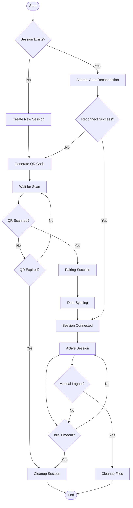
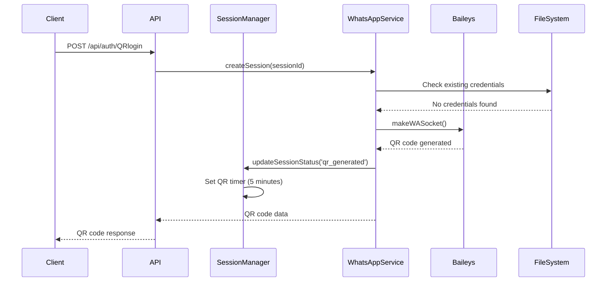
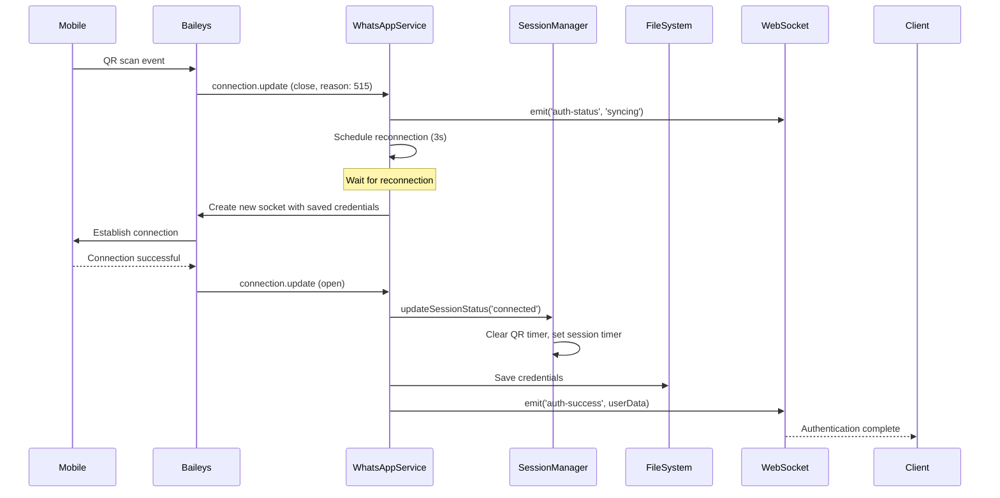
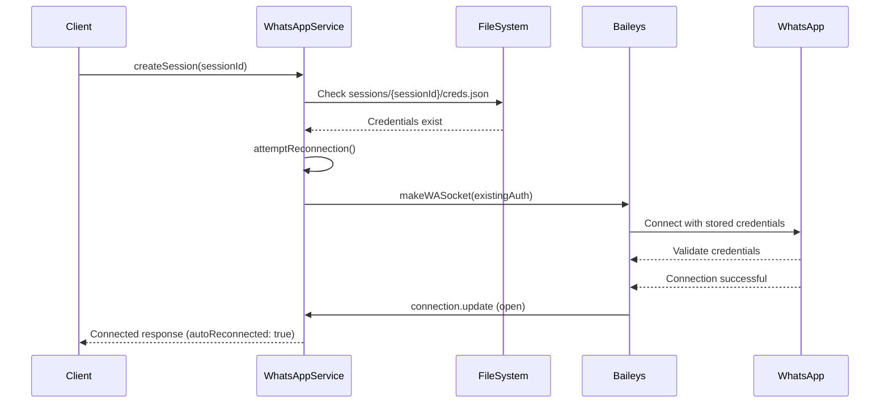

# Session Lifecycle & Cleanup Guide

## Table of Contents
- [Session Lifecycle Overview](#session-lifecycle-overview)
- [Session States](#session-states)
- [Session Creation Process](#session-creation-process)
- [Authentication Flow](#authentication-flow)
- [Session Management](#session-management)
- [Cleanup Mechanisms](#cleanup-mechanisms)
- [File System Management](#file-system-management)
- [Multi-Device Session Handling](#multi-device-session-handling)
- [Troubleshooting](#troubleshooting)
- [Best Practices](#best-practices)
- [Monitoring & Maintenance](#monitoring--maintenance)

## Session Lifecycle Overview

The WhatsApp session lifecycle consists of multiple stages from creation to termination, with automatic cleanup mechanisms to ensure optimal resource usage and prevent memory leaks.



## Session States

### State Definitions

| State | Description | Duration | Next States |
|-------|-------------|----------|-------------|
| `connecting` | Initial connection attempt | 60s timeout | `qr_generated`, `connected` |
| `qr_generated` | QR code generated and displayed | 5 minutes | `pairing_success`, `qr_expired` |
| `pairing_success` | QR scanned, initiating pairing | 30s | `syncing` |
| `syncing` | WhatsApp syncing data after pairing | 60s | `connected` |
| `connected` | Fully connected and operational | 2 hours max | `reconnecting`, `disconnected` |
| `reconnecting` | Attempting to reconnect | 60s timeout | `connected`, `disconnected` |
| `disconnected` | Connection lost | - | `connecting`, `logged_out` |
| `qr_expired` | QR code expired without scan | - | Session cleanup |
| `logged_out` | Permanently logged out | - | Session cleanup |
| `expired` | Session expired due to inactivity | - | Session cleanup |

### State Transitions

```javascript
// SessionManager state management
const validTransitions = {
  'connecting': ['qr_generated', 'connected', 'disconnected'],
  'qr_generated': ['pairing_success', 'qr_expired', 'connected'],
  'pairing_success': ['syncing', 'disconnected'],
  'syncing': ['connected', 'disconnected'],
  'connected': ['reconnecting', 'disconnected', 'logged_out'],
  'reconnecting': ['connected', 'disconnected'],
  'disconnected': ['connecting', 'logged_out'],
  'qr_expired': [], // Terminal state
  'logged_out': [], // Terminal state
  'expired': []     // Terminal state
};
```

## Session Creation Process

### 1. Initial Session Creation

```javascript
// WhatsAppService.createSession() process
async function createSession(sessionId) {
  // Step 1: Check existing session
  const existingSession = this.activeConnections.get(sessionId);
  if (existingSession && existingSession.user) {
    return existingConnectionResponse();
  }
  
  // Step 2: Check stored credentials
  const credsPath = path.join(sessionPath, 'creds.json');
  if (fs.existsSync(credsPath)) {
    const reconnectResult = await this.attemptReconnection(sessionId);
    if (reconnectResult) return reconnectResult;
  }
  
  // Step 3: Create session directory
  const sessionPath = path.join(process.cwd(), 'sessions', sessionId);
  if (!fs.existsSync(sessionPath)) {
    fs.mkdirSync(sessionPath, { recursive: true });
  }
  
  // Step 4: Initialize Baileys socket
  const { state, saveCreds } = await useMultiFileAuthState(sessionPath);
  const sock = makeWASocket(socketConfig);
  
  // Step 5: Add to SessionManager
  await SessionManager.addSession(sessionId, sock);
  
  // Step 6: Set up event handlers
  return this.waitForQRCodeOrConnection(sock, sessionId);
}
```

### 2. Session Directory Structure

```
sessions/
├── {sessionId}/
│   ├── creds.json                    # Main credentials file
│   ├── pre-key-1.json               # Pre-keys for encryption
│   ├── pre-key-2.json
│   ├── ...
│   ├── session-919409010977.0.json  # Session keys per contact
│   ├── app-state-sync-key-*.json    # App state sync keys
│   └── sender-key-*.json            # Sender keys
```

### 3. Socket Configuration

```javascript
const socketConfig = {
  auth: state,
  printQRInTerminal: false,
  logger: baileysLogger,
  browser: ['WhatsApp Web', 'Chrome', '1.0.0'],
  connectTimeoutMs: 60000,
  defaultQueryTimeoutMs: 60000,
  keepAliveIntervalMs: 10000,
  emitOwnEvents: true,
  fireInitQueries: true,
  generateHighQualityLinkPreview: true,
  syncFullHistory: false,
  markOnlineOnConnect: true,
  shouldSyncHistoryMessage: msg => {
    return !!msg.message && !msg.key.remoteJid?.endsWith('@g.us');
  },
  linkPreviewImageThumbnailWidth: 192,
  transactionOpts: {
    maxCommitRetries: 5,
    delayBetweenTriesMs: 3000
  }
};
```

## Authentication Flow

### 1. QR Code Generation Flow



### 2. Authentication Success Flow



### 3. Auto-Reconnection Flow



## Session Management

### 1. SessionManager Configuration

```javascript
const config = {
  QR_EXPIRY_TIME: 5 * 60 * 1000,        // 5 minutes
  SESSION_IDLE_TIME: 15 * 60 * 1000,    // 15 minutes of inactivity
  MAX_SESSION_TIME: 2 * 60 * 60 * 1000, // 2 hours max session
  CLEANUP_INTERVAL: 5 * 60 * 1000,      // 5 minutes cleanup interval
  MAX_CONCURRENT_SESSIONS: 50           // Max 50 sessions per instance
};
```

### 2. Timer Management

#### QR Expiry Timer
```javascript
setQRTimer(sessionId) {
  this.clearQRTimer(sessionId);
  
  const timer = setTimeout(async () => {
    try {
      logger.info(`QR code expired for session ${sessionId}`);
      await this.handleQRExpiry(sessionId);
    } catch (error) {
      logger.error(`Error handling QR expiry for ${sessionId}:`, error);
    }
  }, this.config.QR_EXPIRY_TIME);

  this.qrTimers.set(sessionId, timer);
}
```

#### Session Idle Timer
```javascript
setSessionTimer(sessionId) {
  this.clearSessionTimer(sessionId);
  
  const timer = setTimeout(async () => {
    try {
      logger.info(`Session ${sessionId} expired due to inactivity`);
      await this.removeSession(sessionId, 'expired');
    } catch (error) {
      logger.error(`Error expiring session ${sessionId}:`, error);
    }
  }, this.config.SESSION_IDLE_TIME);

  this.sessionTimers.set(sessionId, timer);
}
```

### 3. Session Activity Tracking

```javascript
updateSessionActivity(sessionId) {
  const sessionData = this.activeConnections.get(sessionId);
  if (sessionData) {
    sessionData.lastActivity = new Date();
    this.setSessionTimer(sessionId); // Reset the timer
  }
}
```

## Cleanup Mechanisms

### 1. Automatic Cleanup Scheduler

```javascript
startCleanupScheduler() {
  this.cleanupInterval = setInterval(() => {
    this.performCleanup();
  }, this.config.CLEANUP_INTERVAL);
  
  logger.info('Session cleanup scheduler started');
}

async performCleanup() {
  try {
    const now = new Date();
    const sessionsToRemove = [];

    // Check for expired sessions
    for (const [sessionId, sessionData] of this.activeConnections.entries()) {
      const timeSinceLastActivity = now - sessionData.lastActivity;
      const timeSinceCreation = now - sessionData.createdAt;

      // Remove if idle for too long or exceeded max time
      if (timeSinceLastActivity > this.config.SESSION_IDLE_TIME || 
          timeSinceCreation > this.config.MAX_SESSION_TIME) {
        sessionsToRemove.push(sessionId);
      }
    }

    // Remove expired sessions
    for (const sessionId of sessionsToRemove) {
      await this.removeSession(sessionId, 'cleanup');
    }

    // Clean up orphaned database sessions
    await this.cleanupOrphanedSessions();

    if (sessionsToRemove.length > 0) {
      logger.info(`Cleanup completed: removed ${sessionsToRemove.length} sessions`);
    }
  } catch (error) {
    logger.error('Error during cleanup:', error);
  }
}
```

### 2. Manual Session Removal

```javascript
async removeSession(sessionId, reason = 'manual') {
  try {
    const sessionData = this.activeConnections.get(sessionId);
    
    if (sessionData) {
      // Close socket connection
      if (sessionData.socket && typeof sessionData.socket.end === 'function') {
        sessionData.socket.end();
      }
      
      this.activeConnections.delete(sessionId);
    }

    // Clear timers
    this.clearSessionTimer(sessionId);
    this.clearQRTimer(sessionId);

    // Update database
    await WhatsAppSessionDAO.deactivateSession(sessionId);

    // Clean up session files if manual logout
    if (reason === 'manual' || reason === 'logout') {
      await this.cleanupSessionFiles(sessionId);
    }

    logger.info(`Session ${sessionId} removed (reason: ${reason})`);
    return true;
  } catch (error) {
    logger.error(`Error removing session ${sessionId}:`, error);
    throw error;
  }
}
```

### 3. Cleanup Triggers

| Trigger | Description | Action |
|---------|-------------|---------|
| **QR Expiry** | QR code not scanned within 5 minutes | Remove session, keep files |
| **Session Idle** | No activity for 15 minutes | Remove session, keep files |
| **Max Session Time** | Session active for 2+ hours | Remove session, keep files |
| **Manual Logout** | User explicitly logs out | Remove session, delete files |
| **Connection Error** | Permanent connection failure | Remove session, keep files |
| **Server Shutdown** | Graceful server termination | Remove all sessions, keep files |

## File System Management

### 1. Session File Cleanup

```javascript
async cleanupSessionFiles(sessionId) {
  try {
    const sessionPath = path.join(process.cwd(), 'sessions', sessionId);
    if (fs.existsSync(sessionPath)) {
      fs.rmSync(sessionPath, { recursive: true, force: true });
      logger.info(`Cleaned up session files for ${sessionId}`);
    }
  } catch (error) {
    logger.error(`Error cleaning up session files for ${sessionId}:`, error);
  }
}
```

### 2. Emergency Cleanup Script

```javascript
// emergency-cleanup-sessions.js
import fs from 'fs';
import path from 'path';

const sessionDir = path.join(process.cwd(), 'sessions');
const now = new Date();
const maxAge = 10 * 60 * 1000; // 10 minutes

try {
  if (fs.existsSync(sessionDir)) {
    const entries = fs.readdirSync(sessionDir, { withFileTypes: true });
    let removedCount = 0;

    for (const entry of entries) {
      if (entry.isDirectory()) {
        const dirPath = path.join(sessionDir, entry.name);
        const stats = fs.statSync(dirPath);
        const age = now - stats.mtime;

        if (age > maxAge) {
          fs.rmSync(dirPath, { recursive: true, force: true });
          removedCount++;
          console.log(`✅ Removed: ${entry.name}`);
        }
      }
    }

    console.log(`\n🧹 Emergency cleanup completed: ${removedCount} directories removed`);
  }
} catch (error) {
  console.error('❌ Emergency cleanup failed:', error.message);
  process.exit(1);
}
```

### 3. Regular Maintenance Script

```javascript
// cleanup-sessions.js
import fs from 'fs';
import path from 'path';

const sessionDir = path.join(process.cwd(), 'sessions');
const now = new Date();
const cleanupAge = 10 * 60 * 1000; // 10 minutes (reduced from 1 hour)

console.log('🧹 Starting session cleanup...');
console.log(`📍 Session directory: ${sessionDir}`);
console.log(`⏰ Cleanup age threshold: ${cleanupAge / 60000} minutes`);

try {
  if (!fs.existsSync(sessionDir)) {
    console.log('📁 Sessions directory does not exist, creating...');
    fs.mkdirSync(sessionDir, { recursive: true });
    console.log('✅ Sessions directory created');
    process.exit(0);
  }

  const entries = fs.readdirSync(sessionDir, { withFileTypes: true });
  let removedCount = 0;
  let totalCount = 0;

  console.log(`\n📋 Found ${entries.length} entries in sessions directory`);

  for (const entry of entries) {
    if (entry.isDirectory()) {
      totalCount++;
      const dirPath = path.join(sessionDir, entry.name);
      
      try {
        const stats = fs.statSync(dirPath);
        const age = now - stats.mtime;
        
        console.log(`📂 ${entry.name}: ${Math.round(age / 60000)} minutes old`);
        
        if (age > cleanupAge) {
          fs.rmSync(dirPath, { recursive: true, force: true });
          removedCount++;
          console.log(`   ✅ Removed (expired)`);
        } else {
          console.log(`   ⏳ Kept (not expired)`);
        }
      } catch (error) {
        console.log(`   ❌ Error processing: ${error.message}`);
      }
    }
  }

  console.log(`\n📊 Cleanup Summary:`);
  console.log(`   Total directories: ${totalCount}`);
  console.log(`   Removed: ${removedCount}`);
  console.log(`   Remaining: ${totalCount - removedCount}`);
  
  if (removedCount > 0) {
    console.log('\n✅ Cleanup completed successfully');
  } else {
    console.log('\n✨ No cleanup needed');
  }

} catch (error) {
  console.error('❌ Cleanup failed:', error.message);
  console.error(error.stack);
  process.exit(1);
}
```

## Multi-Device Session Handling

### 1. Multi-Device Configuration

```javascript
// MultiDeviceSessionManager.js configuration
const config = {
  MAX_DEVICES_PER_PHONE: 50,           // 50 devices per phone
  QR_EXPIRY_TIME: 5 * 60 * 1000,       // 5 minutes
  SESSION_IDLE_TIME: 30 * 60 * 1000,   // 30 minutes
  MAX_SESSION_TIME: 24 * 60 * 60 * 1000, // 24 hours
  CLEANUP_INTERVAL: 10 * 60 * 1000,    // 10 minutes
  DEVICE_HEARTBEAT_INTERVAL: 5 * 60 * 1000, // 5 minutes
  MAX_FAILED_HEARTBEATS: 3             // 3 failed heartbeats
};
```

### 2. Device Session Structure

```javascript
const deviceSessionData = {
  deviceSessionId: 'phone123_device1',
  phoneNumber: '1234567890',
  socket: sockInstance,
  deviceInfo: {
    deviceName: 'Device_1',
    userAgent: 'Chrome',
    ipAddress: '192.168.1.100',
    platform: 'Web'
  },
  createdAt: new Date(),
  lastActivity: new Date(),
  lastHeartbeat: new Date(),
  status: 'connected',
  isActive: true,
  failedHeartbeats: 0,
  messagesSent: 0,
  messagesReceived: 0
};
```

### 3. Device Cleanup Process

```javascript
async performDeviceCleanup() {
  const now = new Date();
  const sessionsToRemove = [];

  for (const [deviceSessionId, deviceSession] of this.deviceSessions.entries()) {
    const timeSinceLastActivity = now - deviceSession.lastActivity;
    const timeSinceCreation = now - deviceSession.createdAt;
    const timeSinceHeartbeat = now - deviceSession.lastHeartbeat;

    // Remove if expired by any criteria
    if (timeSinceLastActivity > this.config.SESSION_IDLE_TIME ||
        timeSinceCreation > this.config.MAX_SESSION_TIME ||
        timeSinceHeartbeat > (this.config.DEVICE_HEARTBEAT_INTERVAL * 2)) {
      sessionsToRemove.push(deviceSessionId);
    }
  }

  for (const deviceSessionId of sessionsToRemove) {
    await this.removeDeviceSession(deviceSessionId, 'cleanup');
  }
}
```

## Troubleshooting

### Common Issues and Solutions

#### 1. Session Limit Reached
**Problem**: "Maximum concurrent sessions limit reached"
```javascript
// Check current session count
const stats = SessionManager.getStats();
console.log(`Active sessions: ${stats.activeSessions}/${stats.maxSessions}`);

// Solution 1: Emergency cleanup
node emergency-cleanup-sessions.js

// Solution 2: Restart server to reset in-memory count
npm restart

// Solution 3: Increase session limit (temporary)
// In SessionManager.js, increase MAX_CONCURRENT_SESSIONS
```

#### 2. QR Code Not Generating
**Problem**: Session stuck in connecting state
```javascript
// Check session status
const session = SessionManager.getSession(sessionId);
console.log('Session status:', session?.status);

// Solution: Remove stuck session and recreate
await SessionManager.removeSession(sessionId, 'stuck');
```

#### 3. Files Not Cleaning Up
**Problem**: Session directories accumulating
```bash
# Check session directory
ls -la sessions/

# Manual cleanup
node cleanup-sessions.js

# Check filesystem permissions
ls -la sessions/
```

#### 4. Memory Leaks
**Problem**: Memory usage increasing over time
```javascript
// Check active connections
console.log('Active connections:', SessionManager.getAllSessions().length);
console.log('QR timers:', SessionManager.qrTimers.size);
console.log('Session timers:', SessionManager.sessionTimers.size);

// Solution: Restart scheduler
SessionManager.stopCleanupScheduler();
SessionManager.startCleanupScheduler();
```

### Debug Commands

```bash
# Check session directory size
du -sh sessions/

# Count session directories
find sessions/ -type d -mindepth 1 | wc -l

# Find old sessions
find sessions/ -type d -mtime +1

# Check running processes
ps aux | grep node

# Monitor memory usage
node --expose-gc app.js
# In app: global.gc(); console.log(process.memoryUsage());
```

## Best Practices

### 1. Session Management
- **Use descriptive session IDs**: Include user/device identifiers
- **Implement proper error handling**: Always wrap session operations in try-catch
- **Monitor session counts**: Set up alerting for approaching limits
- **Regular cleanup**: Run cleanup scripts during low-traffic periods

### 2. File System Management
- **Regular monitoring**: Check session directory sizes
- **Backup credentials**: Before cleanup, consider backing up important sessions
- **Disk space monitoring**: Ensure adequate space for session files
- **Permission management**: Verify proper file permissions

### 3. Error Handling
```javascript
// Proper session creation error handling
try {
  const result = await WhatsAppService.createSession(sessionId);
  return result;
} catch (error) {
  logger.error(`Session creation failed for ${sessionId}:`, error);
  
  // Cleanup on error
  await SessionManager.removeSession(sessionId, 'error');
  
  // Return user-friendly error
  throw new Error('Failed to create WhatsApp session. Please try again.');
}
```

### 4. Performance Optimization
- **Timer consolidation**: Use single cleanup scheduler for multiple checks
- **Batch operations**: Process multiple sessions in batches
- **Memory monitoring**: Implement memory usage alerts
- **Connection pooling**: Reuse database connections

## Monitoring & Maintenance

### 1. Health Metrics

```javascript
// Session health metrics
const getSessionHealth = () => ({
  activeSessions: SessionManager.activeConnections.size,
  maxSessions: SessionManager.config.MAX_CONCURRENT_SESSIONS,
  utilizationPercent: (SessionManager.activeConnections.size / SessionManager.config.MAX_CONCURRENT_SESSIONS) * 100,
  qrTimers: SessionManager.qrTimers.size,
  sessionTimers: SessionManager.sessionTimers.size,
  memoryUsage: process.memoryUsage(),
  uptime: process.uptime()
});
```

### 2. Monitoring Dashboard

```javascript
// Health check endpoint with detailed metrics
app.get('/api/health/detailed', (req, res) => {
  const health = getSessionHealth();
  const sessionStats = SessionManager.getAllSessions().map(session => ({
    sessionId: session.sessionId,
    status: session.status,
    ageMinutes: Math.round((new Date() - session.createdAt) / 60000),
    idleMinutes: Math.round((new Date() - session.lastActivity) / 60000)
  }));

  res.json({
    status: 'OK',
    timestamp: new Date().toISOString(),
    metrics: health,
    sessions: sessionStats
  });
});
```

### 3. Automated Maintenance Schedule

```bash
# Crontab entries for automated maintenance
# Run cleanup every 15 minutes
*/15 * * * * cd /path/to/whatsapp && node cleanup-sessions.js >> logs/cleanup.log 2>&1

# Daily health check and reporting
0 2 * * * cd /path/to/whatsapp && node health-check.js >> logs/health.log 2>&1

# Weekly emergency cleanup
0 3 * * 0 cd /path/to/whatsapp && node emergency-cleanup-sessions.js >> logs/emergency.log 2>&1
```

### 4. Alerting Rules

```javascript
// Simple alerting system
const checkAlerts = () => {
  const stats = SessionManager.getStats();
  
  // High session utilization
  if (stats.utilizationPercent > 80) {
    logger.warn(`High session utilization: ${stats.utilizationPercent}%`);
    // Send alert (email, Slack, etc.)
  }
  
  // Memory usage alert
  const memUsage = process.memoryUsage();
  const memUsageMB = memUsage.rss / 1024 / 1024;
  if (memUsageMB > 1000) { // 1GB
    logger.warn(`High memory usage: ${memUsageMB}MB`);
  }
  
  // Timer leak detection
  if (stats.qrTimers > stats.activeSessions * 2) {
    logger.warn(`Possible timer leak: ${stats.qrTimers} QR timers`);
  }
};

// Run every 5 minutes
setInterval(checkAlerts, 5 * 60 * 1000);
```

This comprehensive guide covers all aspects of session lifecycle management and cleanup procedures, ensuring optimal performance and resource utilization for the WhatsApp API system.
